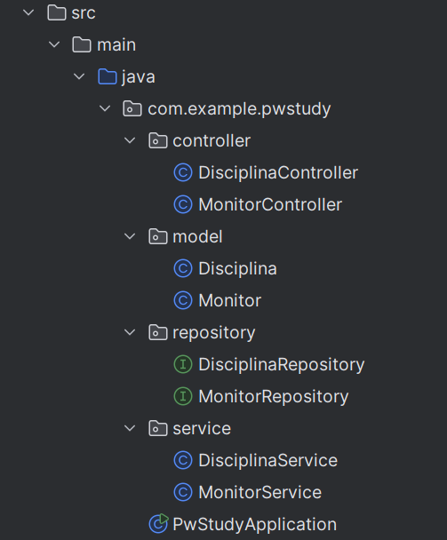
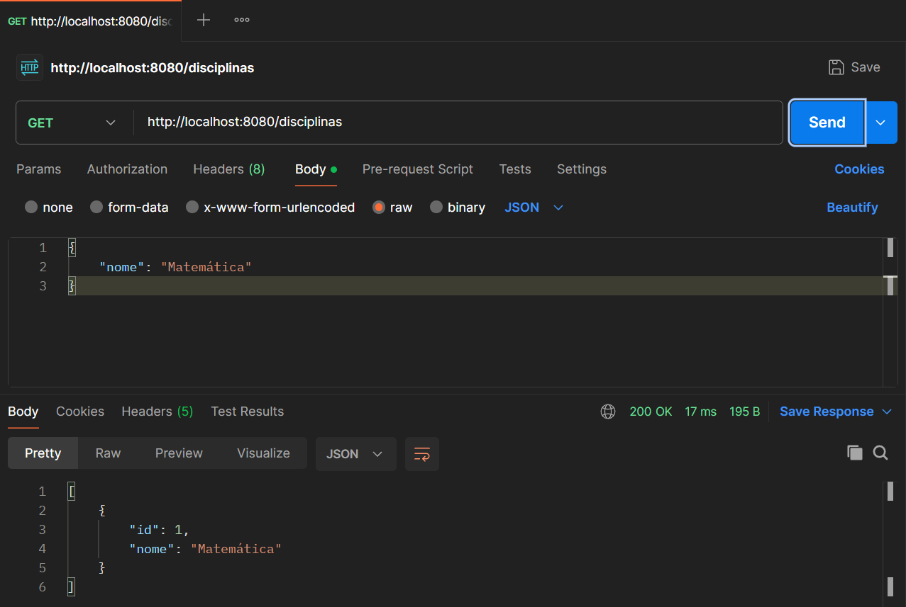

# API Educacional com Spring Boot


Este projeto é uma aplicação Spring Boot que implementa uma API RESTful para gerenciar entidades relacionadas a disciplinas e monitores. A seguir, apresentamos uma descrição detalhada do processo de desenvolvimento, incluindo as ferramentas utilizadas, as etapas de criação e modelagem do código, e os testes realizados.

## Ferramentas Utilizadas

*   **Spring Boot**: Framework utilizado para criar a aplicação web.
*   **Spring Initializr**: Ferramenta online para gerar a estrutura inicial do projeto Spring Boot.
*   **IntelliJ IDEA**: Ambiente de desenvolvimento integrado (IDE) utilizado para escrever e gerenciar o código.
*   **Maven**: Sistema de gerenciamento de dependências utilizado para gerenciar as bibliotecas do projeto.
*   **H2 Database**: Banco de dados em memória utilizado para persistir os dados durante o desenvolvimento.
*   **Postman**: Ferramenta utilizada para testar a API RESTful.

## Etapas de Criação do Projeto

### 1. Criação do Projeto com Spring Initializr

Iniciamos o projeto utilizando o [Spring Initializr](https://start.spring.io/):

*   **Tipo de Projeto**: Maven Project
*   **Linguagem**: Java
*   **Versão**: Spring Boot 3.2.11
*   **Grupo**: com.example
*   **Artefato**: pw-study
*   **Nome**: pw-study
*   **Descrição**: Projeto de Estudo
*   **Pacote Base**: com.example.pwstudy
*   **Dependências**:
    *   Spring Web
    *   Spring Data JPA
    *   H2 Database
    *   Spring Boot DevTools
    *   Spring Boot Starter Test

Após configurar as opções, geramos e baixamos o projeto, que foi importado no IntelliJ IDEA.

### 2. Estrutura do Projeto

Após importar o projeto no IntelliJ IDEA, a estrutura do diretório foi organizada da seguinte forma:



*A imagem mostra a estrutura de um projeto Java, organizado com a estrutura MVC (Model-View-Controller). Ele inclui controladores, modelos, repositórios e serviços para as entidades "Disciplina" e "Monitor". O projeto é iniciado pela classe "PwStudyApplication".*

# 3. Criação das Entidades e Repositórios  
## 3.1. Modelando a Entidade Disciplina  

Criamos a classe Disciplina para representar a entidade:  

```java
package com.example.pwstudy.model;

import javax.persistence.*;
import javax.validation.constraints.NotBlank;

@Entity
public class Disciplina {
    @Id
    @GeneratedValue(strategy = GenerationType.IDENTITY)
    private Long id;

    @NotBlank(message = "O nome da disciplina é obrigatório")
    private String nome;

    // Getters e Setters
}
```
Anotações JPA:

*   `@Entity`: Define a classe como uma entidade JPA.
*   `@Id`: Indica a chave primária da entidade.
*   `@GeneratedValue`: Define a estratégia de geração do ID.
*   `@NotBlank`: Validação para garantir que o nome não seja vazio.

## 3.2. Criando o Repositório  

Criamos uma interface para o repositório da disciplina:  

```java
package com.example.pwstudy.repository;

import com.example.pwstudy.model.Disciplina;
import org.springframework.data.jpa.repository.JpaRepository;
import org.springframework.stereotype.Repository;

@Repository
public interface DisciplinaRepository extends JpaRepository<Disciplina, Long> {
}
```
`JpaRepository`: Fornece métodos prontos para manipulação de dados da entidade Disciplina.

# 4. Implementando o Serviço  

Criamos a classe DisciplinaService para encapsular a lógica de negócios:  

```java
package com.example.pwstudy.service;

import com.example.pwstudy.model.Disciplina;
import com.example.pwstudy.repository.DisciplinaRepository;
import org.springframework.beans.factory.annotation.Autowired;
import org.springframework.stereotype.Service;

import java.util.List;
import java.util.Optional;

@Service
public class DisciplinaService {

    @Autowired
    private DisciplinaRepository disciplinaRepository;

    public List<Disciplina> findAll() {
        return disciplinaRepository.findAll();
    }

    public Optional<Disciplina> findById(Long id) {
        return disciplinaRepository.findById(id);
    }

    public Disciplina save(Disciplina disciplina) {
        return disciplinaRepository.save(disciplina);
    }

    public void delete(Long id) {
        disciplinaRepository.deleteById(id);
    }
}
```

# 5. Criando o Controller  

Criamos o DisciplinaController para definir as rotas da API:  

```java
package com.example.pwstudy.controller;

import com.example.pwstudy.model.Disciplina;
import com.example.pwstudy.service.DisciplinaService;
import org.springframework.beans.factory.annotation.Autowired;
import org.springframework.http.HttpStatus;
import org.springframework.http.ResponseEntity;
import org.springframework.web.bind.annotation.*;

import javax.validation.Valid;
import java.util.List;

@RestController
@RequestMapping("/disciplinas")
public class DisciplinaController {
    @Autowired
    private DisciplinaService disciplinaService;

    @GetMapping
    public List<Disciplina> findAll() {
        return disciplinaService.findAll();
    }

    @GetMapping("/{id}")
    public ResponseEntity<Disciplina> findById(@PathVariable Long id) {
        return disciplinaService.findById(id)
                .map(ResponseEntity::ok)
                .orElse(ResponseEntity.notFound().build());
    }

    @PostMapping
    public ResponseEntity<Disciplina> save(@Valid @RequestBody Disciplina disciplina) {
        return new ResponseEntity<>(disciplinaService.save(disciplina), HttpStatus.CREATED);
    }

    @PutMapping("/{id}")
    public ResponseEntity<Disciplina> update(@PathVariable Long id, @Valid @RequestBody Disciplina disciplina) {
        return disciplinaService.findById(id)
                .map(existingDisciplina -> {
                    existingDisciplina.setNome(disciplina.getNome());
                    return new ResponseEntity<>(disciplinaService.save(existingDisciplina), HttpStatus.OK);
                })
                .orElse(ResponseEntity.notFound().build());
    }

    @DeleteMapping("/{id}")
    public ResponseEntity<Void> delete(@PathVariable Long id) {
        disciplinaService.delete(id);
        return ResponseEntity.noContent().build();
    }
}
```

# 6. Configurando o Banco de Dados H2  

A configuração do banco de dados H2 foi feita no arquivo application.properties:  

```properties
spring.application.name=pw-study
spring.h2.console.enabled=true
spring.datasource.url=jdbc:h2:mem:testdb
spring.datasource.driverClassName=org.h2.Driver
spring.datasource.username=sa
spring.datasource.password=
spring.jpa.database-platform=org.hibernate.dialect.H2Dialect
```

# 7. Testando a API com Postman  

Com a aplicação rodando na porta 8080, testamos as seguintes rotas usando o Postman:

## 7.1. Listar todas as Disciplinas  

- Método: GET  
- URL: http://localhost:8080/disciplinas  
- Resposta Esperada: Retorna uma lista de disciplinas em formato JSON.

  
*A imagem mostra uma requisição GET para a API "http://localhost:8080/disciplinas" que envia um objeto JSON com o nome "Matemática". A resposta do servidor é um objeto JSON com o ID 1 e o nome "Matemática*

## 7.2. Adicionar uma Nova Disciplina  

- Método: POST  
- URL: http://localhost:8080/disciplinas  
- Corpo:  

```json
{
    "nome": "Matemática"
}
```
**Resposta Esperada**: Retorna a disciplina criada com o status **201 Created**.

## 7.3. Atualizar uma Disciplina  

- Método: PUT  
- URL: http://localhost:8080/disciplinas/1 (substitua 1 pelo ID da disciplina que deseja atualizar)  
- Corpo:  

```json
{
    "nome": "Matemática Avançada"
}
```
**Resposta Esperada**: Retorna a disciplina atualizada com o status **200 OK**.

## 7.4. Deletar uma Disciplina  

- Método: DELETE  
- URL: http://localhost:8080/disciplinas/1  
- **Resposta Esperada**: Retorna **204 No Content**.

# Considerações Finais  

O projeto PW-Study é uma aplicação básica, mas robusta, que utiliza as melhores práticas do Spring Boot para gerenciamento de APIs RESTful. A combinação de Spring Data JPA e H2 Database permite uma rápida prototipagem e desenvolvimento.

### Créditos

Desenvolvido por Mateus S.  
GitHub: Matz-Turing
